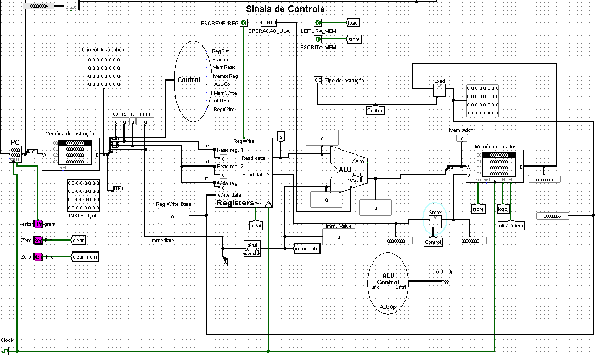
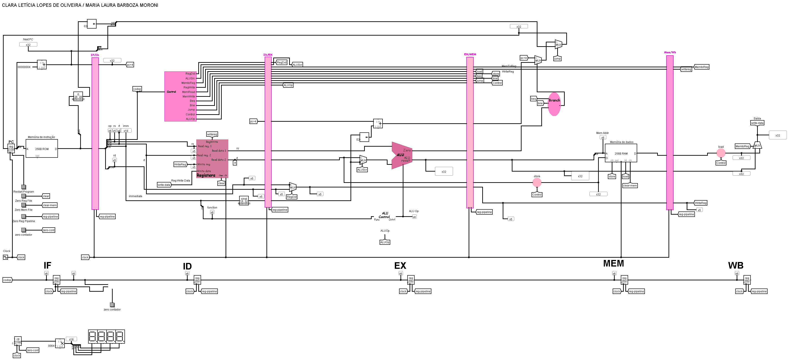

# Implementação MIPS
Esse repositório contém o circuito responsável pela implementação simples do MIPS no Logisim. Esse projeto foi realizado para disciplina de Arquitetura e Organização de Computadores, e será atualizado ao longo da disciplina

### Instruções implementadas

- Instruções de memória: `LB` , `SB` , `LH` , `SH` , `LW` e `SW`
- Intruções lógicas e aritméticas: `ADD` , `SUB` , `AND` , `OR`, `SLT`, `ADDI` , `ANDI`, `ORI` e `SLTI`
- Instruções de salto: `BEQ`, `BNE` e `J`

### Implementações
Nesse repositório, exitem dois tipos de implementações:
- Datapath CPU: [mips-datapath-claura.circ](https://github.com/lauramoroni/mips-logisim/blob/main/mips-datapath-claura.circ)
- 
- Pipeline CPU: [mips-pipeline-claura.circ](https://github.com/lauramoroni/mips-logisim/blob/main/mips-pipeline-claura.circ)
- 

## Carregando memória de instruções

Para testar seu processador, fornecemos as seguintes instruções:

~~~Assembly
lw $t1, 0($zero)
lw $t2, 4($zero)
add $t3, $t1, $t2
add $t3, $t1, $t3
sw $t3, 12($zero)
~~~

Este programa aparece em código de máquina, na forma hexadecimal, no arquivo **“test-code.mem”** fornecido no projeto, usado para inicializar a memória de instruções.

Para usar esses arquivos, é necessário clicar com o botão direito do mouse na **memória de instruções** e nas **memórias de dados** e **carregar os arquivos** com extensão `.mem`.

