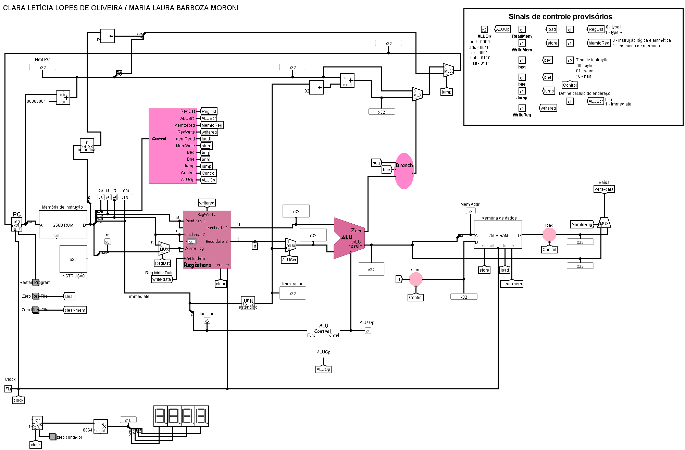

# Implementação MIPS
Esse repositório contém o circuito responsável pela implementação simples do MIPS no Logisim. Esse projeto foi realizado para disciplina de Arquitetura e Organização de Computadores, e será atualizado ao longo da disciplina

### Instruções implementadas

- Instruções de memória: `LB` , `SB` , `LH` , `SH` , `LW` e `SW`
- Intruções lógicas e aritméticas: `ADD` , `SUB` , `AND` , `OR`, `SLT`, `ADDI` , `ANDI`, `ORI` e `SLTI`
- Instruções de salto: `BEQ` e `J`

# Sinais de controle

## Alterar a operação ULA

Para a implementação MIPS funcionar corretamente, é necessário alterar o valor de entrada da `OPERACAO_ULA` do componente ***Arithmetic Logic Unit* (ALU)** para que ela realize a operação aritmética necessária.

O valor de entrada deverá ser `0010` , para que ocorra a soma entre o registrador `rs` e o valor `immediate` . O resultado é o valor de entrada do endereço de memórias.

## Selecionar operação

Para selecionar entre os tipos de operação, segue a tabela abaixo com os valores correspondentes a cada entrada.

| **Instrução** | **Operação ULA** | **READ_MEM** | **WRITE_MEM** | **WRITE_REG** | **Tipo de instrução** | **RegDst** | **MemToReg** | **BEQ** | **BNE** | **Jump** | **ALUsrc** |
| --- | --- | --- | --- | --- | --- | --- | --- | --- | --- | --- | --- |
| load byte | 0010 | 1 | 0 | 1 | 00 | 0 | 1 | 0 | 0 | 0 | 1 |
| store byte | 0010 | 0 | 1 | 0 | 00 | 0 | 0 | 0 | 0 | 0 | 1 |
| load half | 0010 | 1 | 0 | 1 | 01 | 0 | 1 | 0 | 0 | 0 | 1 |
| store half | 0010 | 0 | 1 | 0 | 01 | 0 | 0 | 0 | 0 | 0 | 1 |
| load word | 0010 | 1 | 0 | 1 | 10 | 0 | 1 | 0 | 0 | 0 | 1 |
| store word | 0010 | 0 | 1 | 0 | 10 | 0 | 0 | 0 | 0 | 0 | 1 |
| bne | 0110 | 0 | 0 | 0 | 00 | 0 | 0 | 0 | 1 | 0 | 0 |
| j | 0000 | 0 | 0 | 0 | 00 | 0 | 0 | 0 | 0 | 1 | 0 |
| add | 0010 | 0 | 0 | 1 | 0 | 0 | 0 | 0 | 0 | 0 | 0 |
| and | 0000 | 0 | 0 | 1 | 0 | 0 | 0 | 0 | 0 | 0 | 0 |
| sub | 0110 | 0 | 0 | 1 | 0 | 0 | 0 | 0 | 0 | 0 | 0 |
| or | 0001 | 0 | 0 | 1 | 0 | 0 | 0 | 0 | 0 | 0 | 0 |
| slt | 0111 | 0 | 0 | 1 | 0 | 0 | 0 | 0 | 0 | 0 | 0 |
| addi | 0010 | 0 | 0 | 1 | 0 | 1 | 0 | 0 | 0 | 0 | 0 |
| andi | 0000 | 0 | 0 | 1 | 0 | 1 | 0 | 0 | 0 | 0 | 0 |
| ori | 0001 | 0 | 0 | 1 | 0 | 1 | 0 | 0 | 0 | 0 | 0 |
| slti | 0111 | 0 | 0 | 1 | 0 | 1 | 0 | 0 | 0 | 0 | 0 |

## Carregando memória de instruções

Para testar seu processador, fornecemos as seguintes instruções:

~~~Assembly
sb $t1, 0($t0)
lb $t2, 4($t0)
sh $t1, 0($t0)
lh $t2, 4($t0)
sw $t1, 0($t0)
lw $t2, 4($t0)
~~~

Este programa tem como objetivo testar as operações de `Store` e `Load`.  

Para as operações de `Store` , a lógica consiste em armazenar o **valor** que está no registrador `$t1` no endereço de memória `$t0 + 0` (valor que irá vir da ULA). Já nas instruções `Load` , o objetivo é carregar o **valor** que está armazenado no endereço de memória `$t0 + 4` para o registrador `$t2` .

Este programa aparece em código de máquina, na forma hexadecimal, no arquivo **“test-L-S.mem”** fornecido no projeto, usado para inicializar a memória de instruções.

Para usar esses arquivos, é necessário clicar com o botão direito do mouse na **memória de instruções** e nas **memórias de dados** e **carregar os arquivos** com extensão `.mem`.

## Carregando memória de dados

Para utilizar o exemplo de código fornecido, é necessário inicializar o **endereço de memória** `0x04` com o valor desejado. Isso porque, nas instruções de `Load`, utilizamos o valor que está localizado nesse endereço de memória para carregar e escrever no registrador do exemplo.

## Explicando o componente Load\Store

O circuito para implementar as instruções `Load` e `Store` é o mesmo, diferenciando-se apenas no circuito principal **MIPS**, que é responsável por encaminhar os valores de entrada e saída do componente.

A primeira parte da implementação consiste nas instruções para o `Byte` . O componente recebe um número de **32-bits** do circuito principal, e passa por um distribuidor responsável por selecionar apenas os **8 primeiros bits.** Em seguida, esses bits passam por um extensor de sinal para retornar ao estado de **32-bits,** retornando para o circuito principal.
Para o tipo `Half`, a lógica é similar, com a única diferença de que o distribuidor seleciona os **16 primeiros bits**.  Essa lógica pode ser observada na segunda parte da implementação.

No caso das instruções de `Word` , nenhuma mudança é feita. O valor de entrada permanece o mesmo na saída.
Todas as três operações — `Byte`, `Half` e `Word` — são processadas simultaneamente. No entanto, um **MUX** no final do circuito seleciona qual resultado será encaminhado para a saída, baseado nos sinais de controle.

| Código de controle | Função |
| --- | --- |
| 00 | Load\Store Byte |
| 01 | Load\Store Half |
| 10 | Load\Store Word |

### Instrução Load

Na instrução `Load` , a **entrada do componente** é o valor lido do endereço de memória indicado, e a **saída** é conectada na entrada de `Write data` do componente **Bando de registradores**

### Instrução Store

Já na instrução `Store` , a **entrada do componente** é o valor armazenado no registrador `rt` e a **saída** é direcionada para a entrada `Data` da memória de dados.
